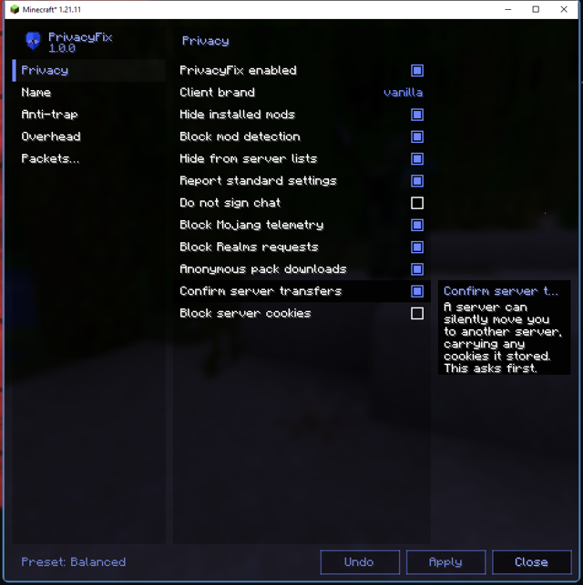

<p align="center">
  
</p>

<h1 align="center">PrivacyFix</h1>

<p align="center">
  Your modded client, indistinguishable from vanilla on the wire.<br>
  <b>1.0.0</b> &middot; Minecraft <b>1.21.11</b> and <b>26.2</b> &middot; Fabric &middot; client-side &middot; MIT
</p>

Servers fingerprint your client: the brand string, the plugin-channel list
every mod registers, invisible sign and anvil probes that only a specific mod
can translate. That is how a server knows you have Freecam before you have
pressed a key. PrivacyFix answers every one of those exactly the way an
unmodified client would, for every mod you run, with nothing to configure
per mod.

It also keeps the rest of your session to yourself: no telemetry, no Realms
polling, no username on resource-pack downloads, optional unsigned chat, and
- for streaming and screenshots - your name, everyone else's, and the server
address hidden everywhere the client draws them. A node editor lets you
rewrite your own outbound packets when you need more than the switches.

One jar in `mods/`. Supported on **Fabric** and **Lunar Client**; Badlion and
Feather are not.

**Install:** drop `sais-privacyfix-<version>.jar` and Fabric API into `mods/`.
The settings live under **Options -> Privacy...**

<p align="center">
  
</p>

---

## What a server actually learns about a Fabric client, and what this does about it

| Leak | How a server gets it | PrivacyFix |
|---|---|---|
| **Brand** | `minecraft:brand` payload says `fabric` (or `lunarclient:…`) | rewritten to `vanilla` |
| **Mod channel list** | Fabric API announces every registered payload channel in `minecraft:register` (`fabric:recipe_sync`, `somemod:config`, `lunar:apollo`, `lunarclient:pm`, …). This is the "mod names in packets". | every outbound custom payload a vanilla client would never send is **dropped** — vanilla only ever sends `minecraft:brand`. Covers every mod, present or future, with no per-mod work. |
| **Translation-key probe** | Server opens a sign editor / anvil pre-filled with `{"translate":"key.somemod.x"}`. Your client translates it and sends the text back. Catches mods with **zero networking** (camera mods, HUD mods, …). | keys not in vanilla's own `en_us.json` are echoed back as the **raw key**, which is exactly what vanilla does. |
| **Keybind probe** | Same trick with `{"keybind":"key.somemod.toggle"}`: renders as the bound key ("F4") only if a mod registered that keybind. **This is how PvPHQ catches Freecam.** | non-vanilla keybind ids are echoed back as the raw id, like vanilla; vanilla ids (`key.attack`) resolve normally so calibration lines still pass. |
| **Login queries** | mods can answer login-phase custom queries | answered "not understood", like vanilla |
| **Server-list exposure** | `allowsListing=true` puts you in the player sample of server pings | forced `false` |
| **Client settings** | `ClientInformation` carries your language, particle setting and text-filter flag - none of them visible to another player, all of them fingerprint bits | normalised to the stock values (toggle). Skin parts and main hand are left alone: those are part of how you look in the world, so normalising them would change your appearance to tell the server nothing it cannot see. |
| **Chat signing** | your client uploads a key Mojang signed against your account and stamps every message with it, so a saved message proves to anyone that you typed it | optional (off by default): the key is never uploaded and chat and commands go out unsigned. A server with `enforce-secure-profile=true` will refuse unsigned chat. |
| **Telemetry** | vanilla only lets you opt out of "extra" telemetry | all session telemetry disabled |
| **Cookies** | servers can store data on your client and read it back | optional block (off by default: proxies need it for transfers); when on, cookie requests are answered "nothing stored" |
| **Required resource packs** | "This server requires a resource pack — reject and you are disconnected." The pack host also learns who you are. | an **X** button on that prompt: the server is told the pack was accepted, downloaded and loaded; nothing is fetched; the server is remembered and skipped silently on later joins; chat shows *"You don't have this server's resource pack. [Download it]"* — click it (or `/privacyfix packdownload`) to really fetch and apply it for this session. Verified on EnchantedMC. |
| **Resource-pack downloads** | every server-pushed pack is fetched with `X-Minecraft-Username` / `X-Minecraft-UUID` headers, usually from a third-party host that now knows who you are + your IP | the two identity headers are stripped (version/pack-format headers stay) |
| **Server transfers** | a server can silently hand you to another host, cookies included | a confirm prompt: "this server wants to send you to host:port" |
| **Realms polling** | the client fetches Realms feature flags at startup and re-checks Realms availability / news / invites on a timer while you sit on the title screen, all authenticated with your session token | none of it goes out (toggle off if you use Realms; the button then errors) |

### Overhead

Honest picture: your outbound traffic is ~95% movement packets, and nothing
can be shaved there without changing gameplay. What this does save:

| | |
|---|---|
| duplicate `ClientInformation` | vanilla sends the identical packet twice at login and again on any options change; exact repeats are dropped |
| Realms / telemetry HTTPS | gone (see above) |
| `viewDistanceCap` (off by default) | the only **big** lever: the server streams `min(server, client)` chunks and chunk data dwarfs everything else you receive. `/privacyfix viewdistance 8` on a 16-chunk render distance cuts chunk traffic by roughly three quarters. You see fewer chunks, obviously. |

Not addressed, on purpose: your IP, username and UUID (the server needs
them), and anything in the *behaviour* of the player. This is a privacy
layer, not a behaviour spoofer.

Outside its reach, worth knowing about:

- **Lunar Client's own traffic.** Lunar talks to Lunar's servers on its own
  connection, outside the Minecraft protocol. A Fabric mod cannot see or
  change that; only what goes to the *game* server is covered here.
- **The multiplayer screen pings every saved server.** That tells each of
  them your IP the moment you open the list, before you join anything. It
  could be blocked, but the screen would stop showing which servers are up,
  which is most of what it is for - so it is left alone.

## Verified

Tested end to end against a local Fabric server running a detection mod
(`probe/`, included) that logs the brand, the channel list, the client info
and runs a sign + anvil translation probe on every player 4 s / 8 s after
join, on both **1.21.11** and **26.2**. Screenshots and server logs are in
`docs/`.

Server log, PrivacyFix **off**:

```
CLIENT BRAND = "fabric"
CLIENT INFO = ClientInformation[language=en_gb, … allowsListing=true …]
CHANNELS REGISTERED BY CLIENT = [fabric:recipe_sync, fabric:attachment_sync_v1, fabric-menu-api-v1:open_screen]
SIGN PROBE RESULT lines= PRIVACYFIX IS INSTALLED | key.somemod.does_not_exist | Singleplayer |
ANVIL PROBE RESULT name= PRIVACYFIX IS INSTALLED
```

Same server, PrivacyFix **on**:

```
CLIENT BRAND = "vanilla"
CLIENT INFO = ClientInformation[language=en_us, … allowsListing=false …]
CHANNELS REGISTERED BY CLIENT = []
SIGN PROBE RESULT lines= key.saisprivacyfix.probe_test | key.somemod.does_not_exist | Singleplayer |
ANVIL PROBE RESULT name= key.saisprivacyfix.probe_test
```

(`Singleplayer` is a vanilla key, `menu.singleplayer`, and is translated in
both cases: that is exactly what a vanilla client returns, so the probe
cannot tell the two apart.)

## Verified on PvPHQ (Lunar Client 1.21.11, real account)

Joined `pvphq.com` from Lunar with freecam, freelook, voicechat, iris, sodium
and friends installed. Within 1 s of the join the server pushed **five sign
editors** at us. Line 0 of each is a UUID nonce (so it can match the reply);
the other lines are packed `|`-separated components:

```
sign 1 (calibration, vanilla keys - a client that blanks everything fails this):
  translate(key.mouse.left fallback="") | ... | keybind(key.attack) | keybind(key.use)
sign 2: keybind(key.accurateblockplacement.toggle) | keybind(key.automine.toggle) | keybind(key.autototem.toggle)
        keybind(key.smartoffhand.totem_swap) | keybind(bedrockIfy.key.settings) | keybind(key.ecs.swap) | keybind(key.elytraswapper.swap)
        keybind(key.freecam.toggle) | keybind(key.healthindicators.renderingEnabled) | keybind(key.legacy-freecam.toggle)
sign 3: keybind(key.midnightcontrols.ring) | keybind(key.proplacer.fast_placement) | keybind(key.punchy.open_config)
        keybind(key.shieldqol.settings) | keybind(key.shouldersurfing.free_look) | keybind(key.autototem.openconfig) ...
sign 4: keybind(key.walljump.walljump) | translate(text.dho.config.screen) | translate(fasterladderclimbing.config.title) ...
sign 5: translate(lootbeams.keybindings.savePreset) | translate(option.moremousetweaks.keybinds) |
        translate(tweakeroo.config.feature_toggle.name.tweakFreeCamera) | translate(key.cartcore.crossbowcart)
```

Every probe uses `fallback=""` so an unmodified client answers with empty
strings. First attempt (translate-only guard) got kicked with
`DISALLOWED MODS: Freecam` because `keybind(key.freecam.toggle)` resolved to
the bound key. With the keybind guard added: no kick, played normally. Full
capture in `docs/pvphq-audit-log.txt`, screenshot in
`docs/pvphq-lunar-mod-on-ingame.png`. Also seen on that join: the server talks
on `minecraft:register` and `vv:server_details` (ViaVersion); dropped outbound
`marlowcrystal:version`, `voicechat:request_secret`, `lunar:apollo`,
`worldedit:cui`, `minecraft:register`.

### Resource-pack skip, verified on EnchantedMC (Lunar 1.21.11)

EnchantedMC pushes a required pack from a DigitalOcean CDN and disconnects
on reject. With the X: `ACCEPTED / DOWNLOADED / SUCCESSFULLY_LOADED` go to
the server, nothing is fetched, we land in the hub with the pack's custom
font showing as `□□□□` (screenshot `docs/enchantedmc-in-without-pack.png`),
`lunar.enchantedmc.net` is added to `packSkipServers`, and the chat line with
the download link appears. Clicking the link fetched the pack from the CDN
(identity headers stripped) and applied it in place
(`docs/enchantedmc-after-download-link.png`). Later joins skip the prompt
entirely.

Consequence of the channel drop: Simple Voice Chat will not connect on any
server unless you `/privacyfix except <server>` it or add
`"voicechat:request_secret"` etc. to `allowedChannels`.

## Install

- **Vanilla / Fabric**: drop the jar for your version into `.minecraft/mods/`
  next to Fabric API.
- **Lunar Client**: drop it into the **profile** mods folder Lunar actually loads from,
  `%USERPROFILE%\.lunarclient\profiles\<profile>\mods\` (e.g. `svc-for-lunar-client`),
  then relaunch the game from the launcher.
  Lunar identifies itself through the brand and the `lunarclient:pm` /
  `lunar:apollo` / `badlion:timers` channels — all covered by the same rules.
  Note that Apollo-based servers use `lunar:apollo` to push settings to Lunar
  mods; with channels blocked they simply see a vanilla client.

## Config: `config/saisprivacyfix.json`

```json
{
  "enabled": true,
  "spoofBrand": true,          "brand": "vanilla",
  "blockModChannels": true,    "allowedChannels": [],
  "probeGuard": true,
  "hideFromServerListings": true,
  "normalizeLanguage": true,
  "blockChatSigning": false,
  "blockTelemetry": true,
  "blockCookies": false,
  "stripPackDownloadHeaders": true,
  "confirmTransfers": true,
  "blockRealms": true,
  "packSkip": true,
  "packSkipServers": [],
  "hideOwnName": false,
  "hideOtherNames": false,
  "hideServerAddress": false,
  "forceClose": true,          "forceLockSeconds": 20,
  "portalChat": true,
  "dedupeClientInfo": true,
  "viewDistanceCap": 0,
  "serverExceptions": [],
  "packetNodes": [],
  "auditLog": true,  "auditChat": true
}
```

- `serverExceptions`: addresses (as typed in the server list) where **nothing**
  is rewritten. Use this for modded servers whose mods genuinely need to talk
  to your client (registry sync etc. would otherwise fail).
- `allowedChannels`: specific channels to let through everywhere, e.g. `"lunar:apollo"`.
- `normalizeLanguage`: reports the settings a stock client reports rather
  than yours - language `en_us`, particles at full, text filtering off. None
  of the three is visible to another player, so nothing about how you look
  or play changes; server-side messages do arrive in English while this is
  on. Skin parts and main hand are deliberately **not** normalised: they are
  part of your appearance in the world, so hiding them in the packet would
  change how you look to everyone while telling the server nothing it could
  not see anyway.
- `blockChatSigning`: off by default. See "Chat signing" below.

## Settings screen

Options gains a **Privacy…** button, added as one more cell in the vanilla
options grid so it follows the same two-per-row / centre-if-alone layout and
resizes with the screen (`docs/options-privacy-button.png`).

It opens PrivacyFix's own screen — no dependency on any other mod. The look
is modelled on Sodium's options UI (same palette and layout metrics, mirrored
into `gui/Theme.java`): icon + version header, page list on the left, tickbox
/ cycling / slider controls, a tooltip panel anchored to the hovered row, and
Undo / Apply / Close with a preset selector (`docs/settings-privacy-page.png`).

Pages: **Privacy**, **Name**, **Overhead**, and **Packets…**
(the per-packet rule editor). The Privacy page ends with a **Crisis**
section holding the force-close settings - what to do when a server is
actively trapping you, rather than a tab of its own for two options. Edits
go to a working copy; **Apply** writes them to `config/saisprivacyfix.json`,
**Undo** reverts, **Close** discards.

## Presets

**Max privacy** turns every switch on, including the four that ship off
because they change how the game behaves: names hidden, address hidden,
cookies refused, chat unsigned. **Balanced** is what the mod does out of the
box - everything that costs you nothing. **Off** is the master switch.

## Chat signing

Your client holds a chat key that Mojang signed against your account. It
uploads that key on join and stamps every message and signed command with
it. The signature is what makes a chat report portable: it proves to anyone
holding the message, not only to the server you said it on, that the line
came from your account.

**Do not sign chat** uploads nothing and sends chat and commands unsigned.
The server still sees the message, and still knows it came from you, because
you are connected as you - what it loses is the transferable proof.

Off by default, because a server started with `enforce-secure-profile=true`
refuses unsigned chat, and your messages would simply not arrive.

Verified as far as the local rig allows: with the option on, a typed line
was rewritten on the way out (`sent chat unsigned` in the audit log) and
still arrived at the server intact. What the rig cannot show is the
difference it makes, because an offline-mode server has no profile key to
validate and marks chat `[Not Secure]` either way; the same is true of the
key upload, which a dev account never sends. On an online-mode server the
audit log will also show `dropped chat session update`.

## Hiding names

The **Name** page (`docs/settings-name-page.png`):

| | |
|---|---|
| **Hide my name** | your name is drawn as `annon` everywhere the client draws it — tab list, your nametag, chat, and any screen or overlay that prints a username |
| **Hide other names** | everyone else becomes `annon1`, `annon2`, … in tab, nametags and chat; the alias sticks to that player for the whole connection |
| **Hide server address** | every address the client draws becomes `annon.gg` — in chat and scoreboards, in the server list, and in the window title outside the game |

Three options, not eight. Learning names, masking whatever is left, and
translating aliases back on the way out are not separate switches: they are
how hiding names works, so they are part of the two toggles above.

Names are learned from four places, because no single one is complete:

1. **the player list** — everyone the server put in your tab list;
2. **chat packets** — the profile attached to a real player-chat message,
   which covers players the tab list never mentions;
3. **a completion request on join** — the client asks the server to complete
   `/msg ` once and keeps the names it offers. On a network this is the only
   source that names players on *other* servers, whose messages reach you
   through global chat. It is the same request the client sends the moment
   you type `/msg ` yourself;
4. **the shape of a chat line** — servers that format chat themselves send it
   as a system message with no sender attached, so the name is taken from its
   position: the text before the first separator (`»`, `›`, `➤`, or `:`/`>`
   when the prefix is short), last token only, so ranks and icons are skipped.

Sources 3 and 4 are part of **Hide other names**; there is nothing extra to
switch on.

The tab list and nametags do not go through any of that: the client knows
which profile each entry belongs to, so the alias is taken straight from it.
A server-set nickname or rank prefix cannot leak a real name there.

Anything still left over is masked: a name at the start of a chat line
becomes `???` when nothing has told the client who it is. A word is only treated as a name when the line gives evidence for
it — a chat separator follows it (`Steve » hi`), or something only said about
a player does (`Steve left the party`) — so ordinary announcements such as
"Welcome to the server!" or "Your kit has been given to you" are left
readable.

Replacement is whole-name only: a known `Bleary` is never substituted inside
`Bleary__`. Aliases apply to chat, the tab list, nametags, titles, subtitles
and the action bar.

Verified with two clients on one server (`docs/names-tab-and-nametag.png`):
tab list read `annon` / `annon1`, the nametag above the other player read
`annon1`, chat read `<annon1> hello from B`, the join message read
`annon1 joined the game` — and a message typed as *"I am annon and B is annon1"*
left the client as **`I am Player310 and B is Player892`**, so the server and
everyone on it see the real names while nothing drawn or recorded on this
client does.

Verified again against a server that formats chat itself and hides most
players from the tab list: a name known only from the `/msg ` completion
rendered as `[VIP] annon2 » hello from far away`, and one the client was never
told about at all rendered as `annon4 » nobody told the client who I am`,
while ordinary text with a colon in it (`blocked probe via sign editor:`) was
left alone.

The name substitution happens where the client renders or sends text. The
server still knows who you are, because you are authenticated as you — same
caveat as your IP. Aliases reset on disconnect.

## Hiding the server address

**Hide server address** replaces every address the client draws with
`annon.gg`. The address you are connected to and every address in your saved
server list are masked, each with and without its port, longest match first,
so `play.example.net:25565` and a bare `play.example.net` in the same line
both go. It covers text the server sends (chat, scoreboards, titles), the
client's own screens, and the window title — so the address is not readable
outside the game either, in a screenshot, a stream or the taskbar.

Editable text fields are left alone, so the Add/Edit Server screen still
shows you what you are typing. The real address is what the client connects
with; only what is drawn changes.

Verified against the test server: a chat line sent as
`Welcome to localhost:25599 - store at localhost for ranks` rendered as
**`Welcome to annon.gg - store at annon.gg for ranks`**, and the window title
read `Minecraft* 26.2 - Multiplayer (3rd-party Server)`.

## Packets

**Packets…** on the Privacy screen opens a node graph. A rule is a chain:
a **when** node matches one outbound packet type, and whatever is wired to it
runs in order.

| node | does |
|---|---|
| **when** | entry point; click its `packet` row for a dropdown of the catalog, grouped by category (actions, blocks & items, movement, chat & commands, inventory, connection & heartbeat, settings & identity) |
| **if** | continues only when a field compares true (equals / not equals / greater / less) |
| **set** | writes a value into a field before the packet is sent |
| **copy** | sends one extra copy of the packet with the set values applied |
| **drop** | stops the packet leaving the client |
| **log** | writes the packet and its decoded fields to the audit log |

Drag a node by its title bar to move it (it settles on the grid), click an
output dot then an input dot to wire them, click a row to change it,
right-click a node to delete it, drag empty space to pan. Scroll inside the
packet dropdown for the rest of the list. A node is drawn as wide as its
widest row needs, so a long packet or field name never runs into its value
(`horizontalCollision  true` stays readable); past a limit the label is cut
with an ellipsis instead of overlapping. Nothing reaches the config until
**Save** (`docs/packets-node-graph.png`).

Field names come from the packet the chain starts at: wire a **set** node to a
**when** node and its rows become that packet's actual fields. Values are
parsed to the field's real type, and anything that throws is logged and
skipped, so a broken graph cannot break the connection.

Verified end to end: a `when ServerboundSwingPacket -> log` graph produced
`graph: ServerboundSwingPacket hand=MAIN_HAND` in the audit log on every
swing, and a saved graph round-tripped through `config/saisprivacyfix.json`
with its wires and values intact.

Verified again through the dropdown, as an A/B/A against the test server's
packet log: with the graph pointed at another packet, four hotbar keys
produced four `HOTBAR SLOT received from client` lines; with the same graph
re-pointed at `SetCarriedItem` from the dropdown and wired to **drop**, four
more key presses moved the hotbar on screen and produced **no** server lines
at all, and four `graph: dropped ServerboundSetCarriedItemPacket` lines in
the audit log; deleting the **when** node and saving put the packets back.

## In-game commands

```
/privacyfix                 status for the current server
/privacyfix except          add the current server to serverExceptions
/privacyfix unexcept        remove it
/privacyfix toggle <all|brand|channels|probe|listing|language|signing|telemetry|cookies
                    |packheaders|transfers|realms|dedupe|packs|force|portalchat
                    |hidename|hideothers|hideaddress|chat|log>
                              (everything is also on the Privacy screen)
/privacyfix packskip          toggle silent pack skipping for the current server
/privacyfix viewdistance <n>  cap the view distance reported to servers (0 = off)
/privacyfix packdownload      really download + apply the pack(s) skipped on this connection
/privacyfix reload          re-read the json
```

`logs/privacyfix-audit.log` in the game folder holds a full trace per join
(what was rewritten, what the server pushed, the exact structure of every
probe). On every join one chat line tells you what happened, e.g.
`[PrivacyFix] brand fabric -> vanilla | dropped channels 1 (minecraft:register) | client info hardened | probe guard on`,
and any probe attempt is shown in red as it happens.

## Support

Free, MIT, no telemetry of its own - obviously. If it saved you a kick and
you want to say thanks, the **Donate** button in the top-right of the
settings screen copies a Monero address:

```
43hsr5xEuU4ELzcGkTG5DSbs7qgjvZpdyKK1Uef8CCnCEoA88ZBZtAuRZeVNZedTTb82PT9v8dh4Cikx4gwELwVbGdSnxdB
```

Questions, bugs, a server that still catches you: Discord **7phd**.

## Building

```
./gradlew build
```

Jars land in `v1_21_11/build/libs` and `v26_2/build/libs` (and the test-rig
server mod in `probe_*/build/libs`). JDK 25 is required for the 26.2 build
(Minecraft's own requirement); 21+ for 1.21.11.

Dev-test loop (what was used for the logs above):

```
# terminal 1: a local Fabric server with Fabric API + dist/sais-privacyfix-probe-<ver>.jar in mods/, online-mode=false
# terminal 2:
./gradlew :v26_2:runClient -Pquickplay=localhost:25565
```

## Layout

```
common/      shared sources + resources (everything that is the same on all versions)
v1_21_11/    1.21.11 subproject (Mojang mappings via Loom) + compat/ChatCompat shim
v26_2/       26.2 subproject (unobfuscated, no mappings)   + compat/ChatCompat shim
probe/       TEST RIG: server-side detection mod, never ship it
probe_*/     probe subprojects per version
docs/        screenshots + server logs from the verification runs
dist/        built jars
```

Icon: `docs/icons/2-shield-eye.png` (16x16 pixel art, shipped at 128x128 as
`assets/saisprivacyfix/icon.png`). It is rendered tinted in the theme colour
in the settings screen header.

The only per-version code is `ChatCompat` (26.2 removed `Gui.getChat()`).
Every mixin target was checked against both game jars with `javap` before
being written; there is no reflection and no version sniffing at runtime.
